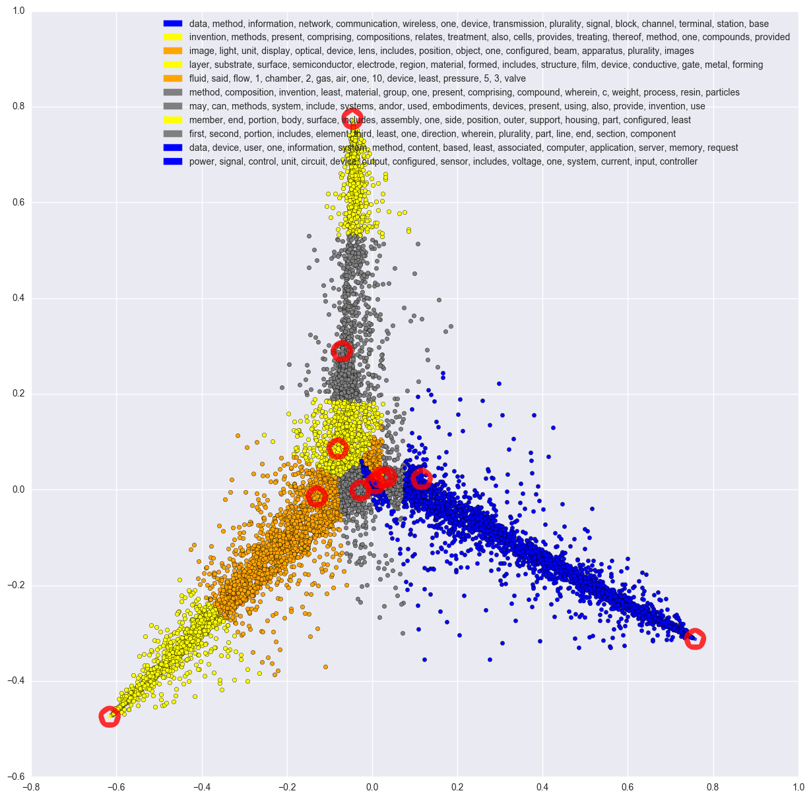

# ADA Project - Patents in Switzerland

| Soufiane El Badraoui | Arnaud Miribel | Yu Yamashita |
|:---:|:---:|:---:|:---:|

## Contents : 

 
- `src/` notebooks, scripts and methods
- `data/` useful data 
- `viz/` some visualizations
- `project_description.md` initial project description

## Progress: 

### November : looking for data

##### Patents

EPO API doesn't really suit our data, so we're looking for the SQL version. Asked help on the EPO forum.

##### Research papers

Interesting talk about text mining for research papers : 

- [Text Mining Research Papers](http://www.uksg.org/sites/uksg.org/files/Text-Mining-Research-Papers.pptx.pdf)

Gives good strategies to do data mining on this kind of papers.  
2 APIs are highlighted : [`arXiv`](https://arxiv.org/help/bulk_data) and [`CORE`](https://core.ac.uk/).  

|API|Query|# of results|Query|# of results|
|:-:|:-:|:-:|:-:|:-:|
|arXiv|EPFL|297|Swiss Federal Institute of Technology Lausanne|1,196,209
|CORE|EPFL| 2,558|Swiss Federal Institute of Technology Lausanne| 3,696,589

|API|Rate limits|Fields|
|:-:|:-:|:-:|
|arXiv|No limit|Computer Science, Physics & Maths
|CORE|~ < 1 request per  10 second| Aggregation of more

> `CORE` aggregates research papers from data providers from all over the world including institutional repositories, subject-repositories and journal publishers. This process, which is called harvesting, allows us to offer search, text-mining and analytical capabilities over not only metadata, but also the full-text of the research papers making `CORE` a unique service in the research community.

> `CORE` currently contains 66,133,153 open access articles, from over 6000 journals, collected from over 2300 repositories around the world.

So although `arXiv` seems to work properly (done in `arxiv.ipynb`), we should maybe give a try to work with `core` 

### December : some explorations

##### Patents

Finally managed to get some data from research paper and gave a try to do topic extraction on it. We still have to know what data we'll use, but the source is clean and we just wanted to do some proof of concepts using :

- Dataset : 10'000 __random__ english patent abstracts from 2016
- Pipeline : 
	- NLP Pre-processing
	- LDA Topic extraction
	- Dimension Reduction
		- using PCA
		- using tSNE
		- using Fischer LDA
	- Visualization

__Using PCA__  

__Using tSNE__  

__Using Fischer LDA__  
