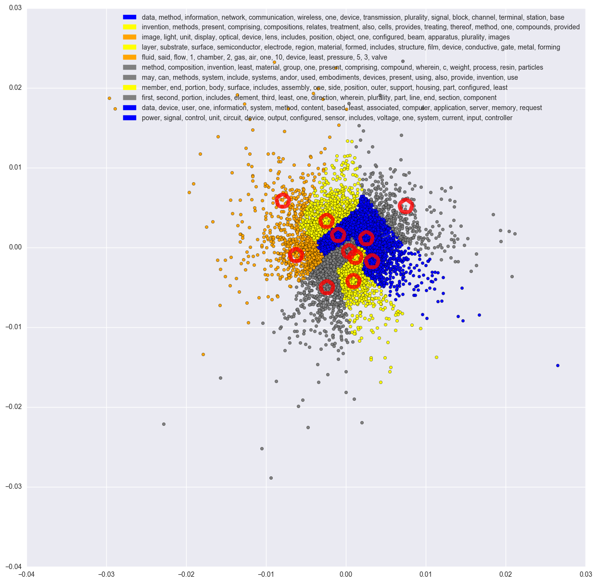
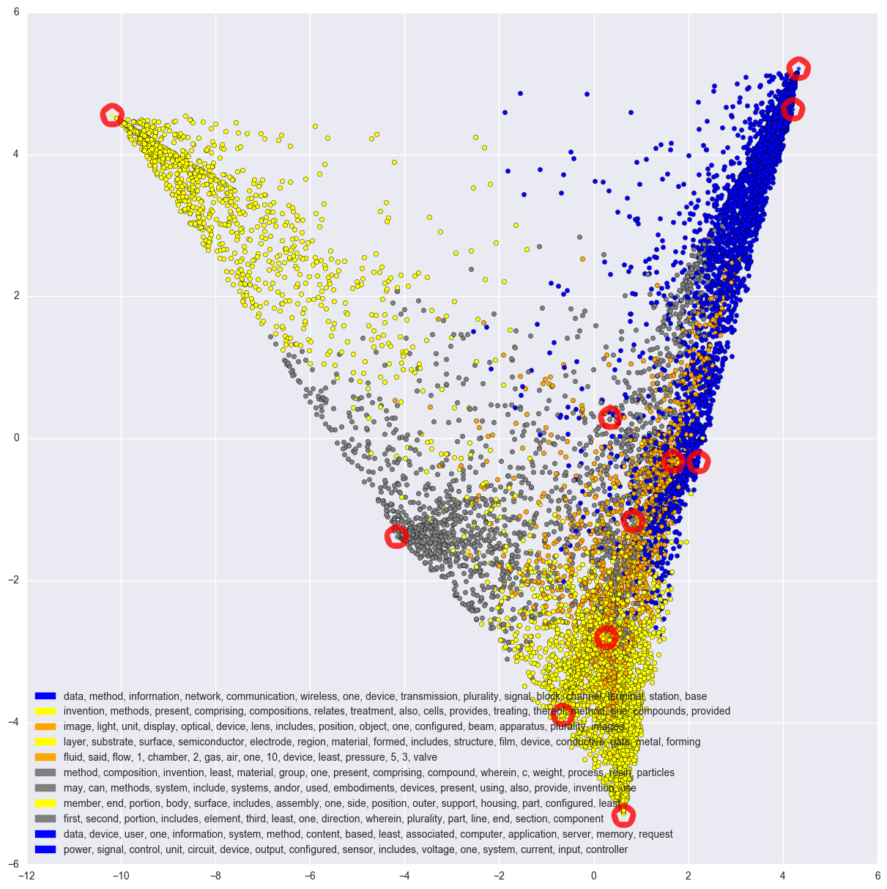

# ADA Project - Patents in Switzerland

| Soufiane El Badraoui | Arnaud Miribel | Yu Yamashita |
|:---:|:---:|:---:|:---:|

## Report :

Please clone this repo and open `index.html` to see the website where our results are explained.

## Contents :

- `src/` notebooks, scripts and methods
- `data/` useful data
- `viz/` some visualizations
- `web/` utils for the webpage under `index.html`
- `project_description.md` initial project description

## Progress:

### November : looking for data

##### Patents

EPO API doesn't really suit our data, so we're looking for the SQL version. Asked help on the EPO forum.

##### Research papers

Interesting talk about text mining for research papers :

- [Text Mining Research Papers](http://www.uksg.org/sites/uksg.org/files/Text-Mining-Research-Papers.pptx.pdf)

Gives good strategies to do data mining on this kind of papers.  
2 APIs are highlighted : [`arXiv`](https://arxiv.org/help/bulk_data) and [`CORE`](https://core.ac.uk/).  

|API|Query|# of results|Query|# of results|
|:-:|:-:|:-:|:-:|:-:|
|arXiv|EPFL|297|Swiss Federal Institute of Technology Lausanne|1,196,209
|CORE|EPFL| 2,558|Swiss Federal Institute of Technology Lausanne| 3,696,589

|API|Rate limits|Fields|
|:-:|:-:|:-:|
|arXiv|No limit|Computer Science, Physics & Maths
|CORE|~ < 1 request per  10 second| Aggregation of more

> `CORE` aggregates research papers from data providers from all over the world including institutional repositories, subject-repositories and journal publishers. This process, which is called harvesting, allows us to offer search, text-mining and analytical capabilities over not only metadata, but also the full-text of the research papers making `CORE` a unique service in the research community.

> `CORE` currently contains 66,133,153 open access articles, from over 6000 journals, collected from over 2300 repositories around the world.

So although `arXiv` seems to work properly (done in `arxiv.ipynb`), we should maybe give a try to work with `core`

### December : some explorations

##### Patents

Finally managed to get some data from research paper and gave a try to do topic extraction on it. We still have to know what data we'll use, but the source is clean and we just wanted to do some proof of concepts using :

- Dataset : 10'000 __random__ english patent abstracts from 2016
- Pipeline :
	- NLP Pre-processing
	- LDA Topic extraction
	- Dimension Reduction
		- using PCA
		- using tSNE
		- using Fischer LDA
	- Visualization

__Using PCA__  

__Using tSNE__  

__Using Fischer LDA__  

__GOOD NEWS__ : seems like we can find interesting topics in an abstract snapshot. We should now have a precise idea of all the data we want to use.

- blue : looks like IT , electrical engineering abstracts (topics 0, 9, 10)
- orange : looks like physics (topics 2, 8)
- yellow : chemistry, materials (topics 1, 7)
- gray : trash topics (3, 4, 6, 5) - can be improved by removing generic terms of research papers (methods, system, invention, present, composition, part, body, end, first, second ...)

## Remains to do :

- select data :
	- how many patents can we hold for topic extraction ?
	- how do we filter such that we fit in the subject ? (is filtering for Swiss patents enough?) - for academic papers, looks like EPFL/ETHZ is enough
	- do want to have a long range of years for data (so that we can see the evolution of innovation accross time) ? how many years ? then we should select random subsets of patents every year ?

-  nlp pipeline :
	- append the stop words list with generic terms of research papers in order to filter them out and maybe avoid having too many trash topics

- topic extraction :
	- test to see what's the optimal number of topics

- data visualization :
	- for semantic map :
		- choose which dimension reduction technique makes the best visualization
		- handle a Bokeh server with a `Choose Year` slider in order to travel accross time. [fun resource in the idea of what we want to do](http://olihb.com/2016/03/24/15-years-of-news-analyzing-cnn-transcripts-visualizing-topics/)
	- for the map  : should be quick using the cloropleth homework
	- for the network : bonus !

  ### January :

  We managed to finish our analysis (essentially filled the "remains to do" part!).
  Just didn't have enough time for the network part. But we're happy of our results
